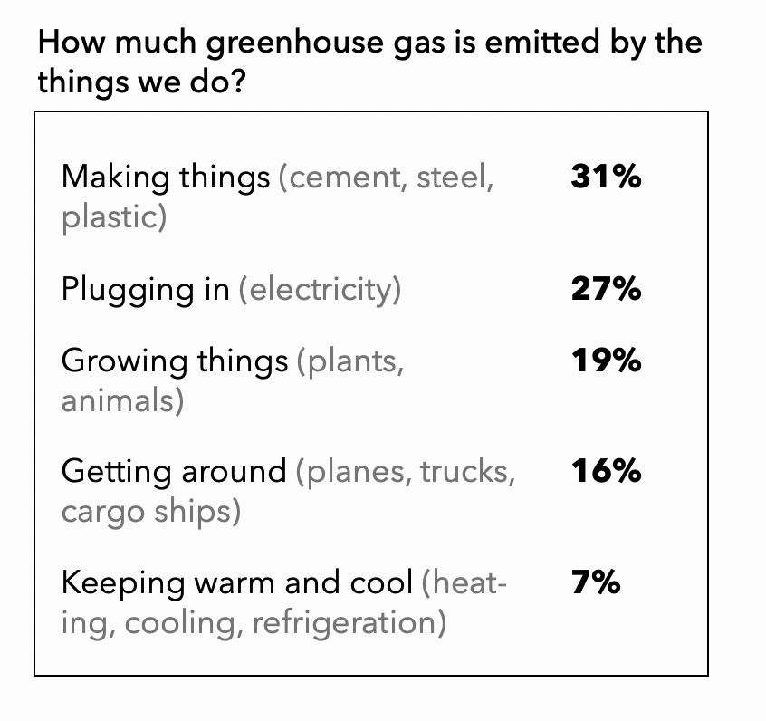
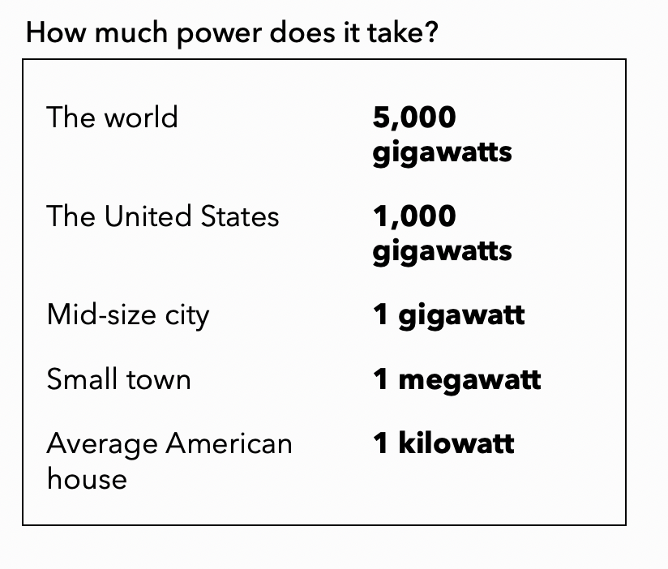
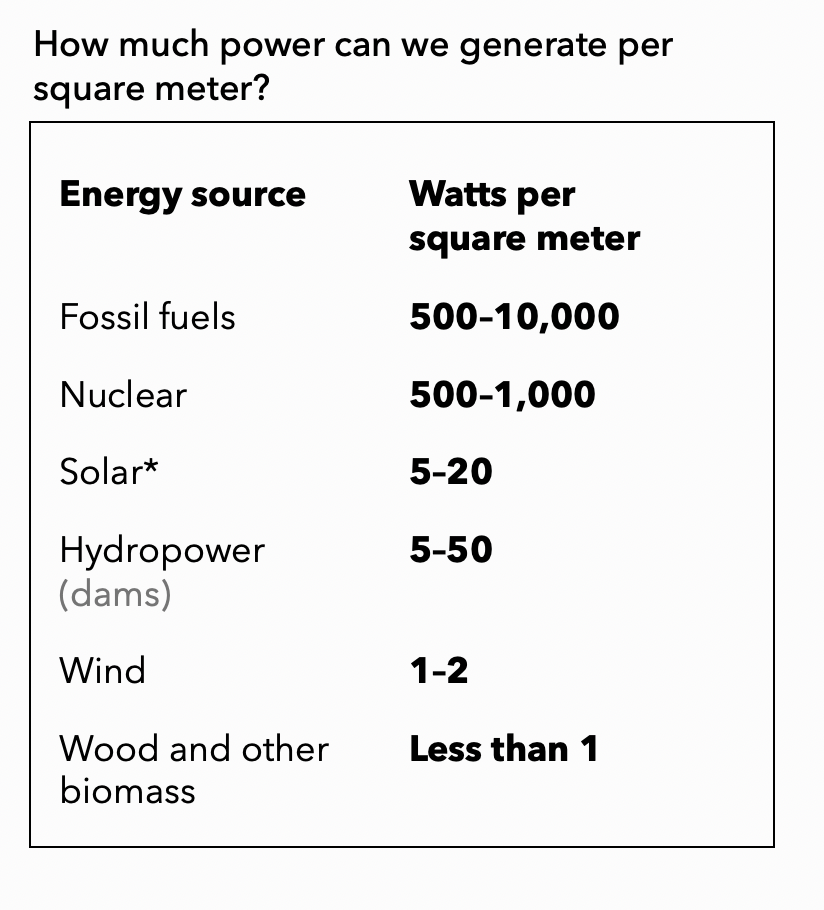
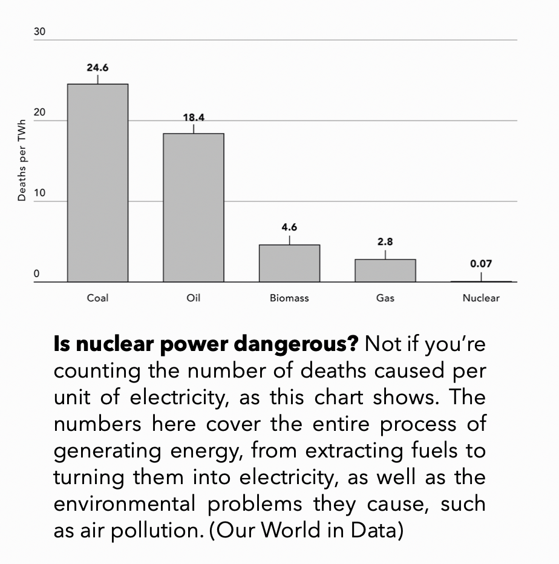
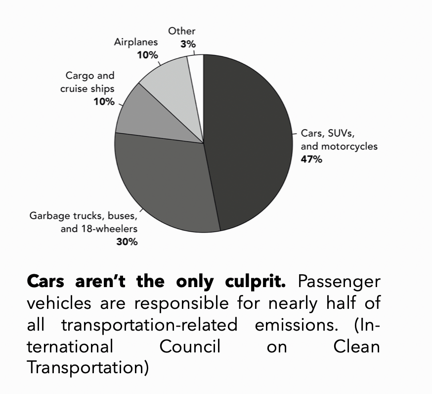

I recently read Bill Gates' new book [*"How to avoid a climate disaster"*](link). It provides a nice summary about key questions about climate change and interesting enough for me to take some notes. Here are some of my notes on a few points that I deem important. It's really non-technical and really grand public. I encourage to read his book, it's quite easy-to-read and quite short. I just write some of my thoughts and notes about each chapter below. It is not an exhaustive summary, only things that I found interesting and that I highlighted in the book. It provides a nice and concise summary of the problems, the solutions, and how to apply them. Fact-based view.

# Introduction : 51 billion to zero

- Every year, the world adds 51 billion tons of greenhouse gases to the atmosphere. Zero is what we should aim for. 

- Renewable energies can help fight climate change and we should increase their deployment. But that won't be enough because i) the wind does not always blow and the sun does not always shine, and ii) because making electricity only accounts for around 25% of all greenhouse gases we emit. 

- Without breakthrough technologies that will take us the rest of the way, we won't be able to avert a climate disaster. Technology is not a sufficient solution, but it is without a doubt a necessary condition.

- It is not fair to tell Indians or citizen in other developing countries that they should not have lights to study, or that thousands of them should die in heat waves because installing air conditioners is bad for the environment. The only viable solution is to make clean energy so cheap that every country would choose it over fossil fuels.

- While the trend is positive, we need the governments to play an even more active role in fighting climate change. Most notably, investment needs to increase massively. In the US, investment to prevent climate changes is far lower than in other essential areas like health or defense. I

- The reason why government need to step in is that investment in clean energy is not always very profitable and usually requires a lot of patience. Private investors, accustomed to the rapid and massive returns of biotechnology or information technology are not always willing to take that kind of risk.

- Reducing the amount of greenhouse gases from 51 billion to 0 will be very hard. During the COVID, the economy slowed massively, millions of people died, tens of millions were put out of work--this was not a situation that anyone would want to repeat. Yet, emission decreased by around 5%: *"What's remarkable is not by how much it decreased, but by how little. This small decline in emissions is proof that we cannot get to zero emissions simply---or even mostly---by flying and driving less."*

# Chapter 1 : Why zero?

- Greenhouse gases trap heat. This causes the average temperature of the earth to go up. The more gases there are, the higher the temperature rises.

- A little increase in temperature can actually be a lot. During the last ice age, temperature was only 6 degrees below what it is today. During the Jurassic, where the temperaturew were around 4 degrees higher than it is today, crocodiles were living in the Arctic.

- Average numbers also don't tell us anything about the variance. Even though the global average temperature has increases by just 1 degree Celsius since pre-industrial times, the temperature has already increased by more than 2 degrees in some places.

There are things we don't know: 

- The IPCC reports acknowledge upfront that there is some uncertainty about how much and how quickly temperatures will go up. Modelling the climate is actually incredibly complex.

But there are also things we know: 

- The earth is warming, and it is warming because of human activity. We have every reason to believe that, at some point "the impact will be catastrophic". We don't know precisely when, but even if the worst case in 50 years away, we need to act now.

- We also know tha there will be more really hot days. This is already happening around the world. But not everyone will suffer equally. Some places may even benefit from warmer temperature. But on average, it seems that more places will suffer from a hotter climate. The extra-heat has also some knock-on effects: while it is still not clear whether storms are happening more frequentlybecause of the heat, they are undoubtedly getting more powerful because of it. Stronger storms create a strange "feast-or-famine" situation. Some places experience more rain while some others more frequent and severe droughts.

- Wildfires occur now five times more often than in the 1970s.

- Sea levels will go up, partly because polar ice is melting, partly because seawater expands when it gets warmer.

- Food production is a more mixed picture. On the one hand, wheat for example grows faster and needs less water when there's a large amount of carbon in the air. On the other hand, corn, for instance, is especially sensitive to heat. Yields could go up in some regions while dropping massively in some other regions. This could lead to large price variations. In poor regions where food accounts for a large part of the budget, rising food prices could be devastating. If the temperature goes up by 2 degrees Celsius, coral reefs could vanish completely and wipe a major source of seafood for more than a billion people.

- Heatstroke may become a much bigger problem. Hundreds of millions of people may be at the risk of dying from it in regions such as the Persian Gulf, South Asia and parts of China.

- Changing climate can also lead to massive migration. One study found that asylum applications to the European Union could go up by 28%, even with moderate warming.

Despite some uncertainty, we understand enough to know that what is coming will be bad. We can do two things about it:

1. Adapt: this means minimizing the impact of the changes that are already under way.
2. Mitigate: that is, stop adding greenhouse gases to the atmosphere. To have any hope of avoiding a disaster, the richest countries need to achieve zero emissions by 2050. Middle-income countries will then have to follow soon after but rich countries need to lead the way.

Climate change is undoubtedly an enormous challenge, but it can also be a huge opportunity: the countries that build great zero-carbon companies and industries will be the ones that lead the global economy in the coming decades.

# Chapter 2 : This will be hard.

- Fossil fuels are everywhere. They are so pervasive that it can be difficult to grasp all the ways in which they touch our lives. But they are everywhere for known reasons: they are dirt cheap. A glass of oil is litterally cheaper than a glass of soft drink. Part of the reason why their prices are so low is that they do not fully reflect the extent of harm they cause for the climate. In economics, this is known as a negative externality.

- The challenge is enormous and can be dizzying, but this does not need to be paralysing. There are ways to overcome this. In particular, we need to deploy clean and renewable energy sources we already have while also making breakthroughs in other zero-carbon energy (deploying technologies we already have will not be enough). Also, we have to act quickly because it is not only the rich world. Almost everywhere, people are living longer and healthier lives. Standards of living are going up. This is a good thing, but this means that the energy used per person will go up.

- It is not moral, and in fact also not realistic to prevent people who are lower down on the economic ladder from climbing up. We can't expect poor people to stay poor because rich countries emitted too many greenhouse gases. The only pragmatic way to go is to make it possible for low income countries to climb the ladder in the environmentally friendly way.

- History is not on our side. Transitions typically take forever. As soon as possible is often a long time away. We've already moved from one source of energy to another in the past, but it took incredibly long. For instance, we stopped burning so much wood and started using more coal. The US is also now using more natural gas and less coal to generate electricity. In both cases, the transition did not happen to preserve the environment, but rather because it was cheaper. If we leave history to its own devide, we will naturally start using more renewables, but this won't happen nearly fast enough. We have to force an unnaturally speedy transition!

- Anything as big and complex than the energy industry will resist change and show a lot of inertia.

- We lack a long-term vision. Our approach to climate and energy keeps changing with the election cycle. Every four to eight years, a new administration arrives with its own priorities. While changing priorities is not inherently wrong, it is very problematic for researchers that depend on government funding and entrepreneurs that rely on tax incentives. It's hard to make real progress if every few years you have to stop work on one project and start from scratch on something else. These problems are particularly acute in the energy sector because energy innovation is so hard and can take decades before it comes to fruition.

- There is not as much of a climate consensus regarding what we should do as one could think. Even if you accept that the climate is changing because of human activities (as 97% of climate scientists), you don't necessarily buy the idea that we should be investing massive amounts of money in breakthroughts designed to deal with it. Some people argue that we should prioritize other things that have bigger impacts on human welfare, such as health or education.

  - Bill Gates' answer: *Unless we move fast toward zero, bad things (and probably many of them) will happen well within most people's lifetime, and very bad things will happen within a generation. Even if climate change doesn't rank as an existential threat to humanity, it will make most people worse off, and it will make the poorest even poorer. It will keep getting worse until we stop adding greenhouse gases to the atmosphere, and it deserves to be as much of a priority as health and education.*

- A last challenge is that global cooperation is notoriously difficult. But the Paris Agreement, in which more than 190 countries signed up to eventually limit their emissions has proven that global cooperation is possible.

# Chapter 3 : 5 questions to ask in every climate conversation

1.  How Much of the 51 Billion Tons Are We Talking About?

-   "Whenever you see some number of tons of greenhouse gases, convert it to a percentage of 51 billion, which is the world's current yearly total emissions (in carbon dioxide equivalents)."

2.  What's your plan for cement?

-   "If you're talking about a comprehensive plan for tackling climate change, you need to consider everything that humans do to cause greenhouse gas emissions. Some things, like electricity and cars, get lots of attention, but they're only the beginning. Passenger cars represent less than half of all the emissions from transportation, which in turn is 16 percent of all emissions worldwide. Meanwhile, making steel and cement alone accounts for around 10 percent of all emissions. So the question "What's your plan for cement?" is just a shorthand reminder that if you're trying to come up with a comprehensive plan for climate change, you have to account for much more than electricity and cars."

{width=50%}

3. How Much Power Are We Talking About?

“Whenever you hear “kilowatt,” think “house.” “Gigawatt,” think “city.” A hundred or more gigawatts, think “big country.”

{width=50%}

4. How Much Space Do You Need?

“Some power sources take up more room than others. This matters for the obvious reason that there is only so much land and water to go around. Space is far from the only consideration, of course, but it’s an important one that we should be talking about more often than we do.”

{width=50%}

“Notice that the power density of solar is considerably higher than that of wind. If you want to use wind instead of solar, you’ll need “ar more land, all other things being equal. This doesn’t mean that wind is bad and solar is good. It just means they have different requirements that should be part of the conversation.”

5. How much is this going to cost?

“The reason the world emits so much greenhouse gas is that—as long as you ignore the long-term damage they do—our current energy technologies are by and large the cheapest ones available. So moving our immense energy economy from “dirty,” carbon-emitting technologies to ones with zero emissions will cost something.”

“Most of these zero-carbon solutions are more expensive than their fossil-fuel counterparts. In part, that’s because the prices of fossil fuels don’t reflect the environmental damage they inflict so they seem cheaper than the alternative. These additional costs are what is 
called Green Premiums.”

“In rare cases, a Green Premium can be negative; that is, going green can be cheaper than sticking with fossil fuels. For instance, depending on where you live, you may be able to save money by replacing your natural gas furnace and your air conditioner with an electric heat pump.”

“Once you’ve figured Green Premiums for all the big zero-carbon options, you can start having serious conversations about trade-offs. How much are we willing to pay to go green? Will we buy advanced biofuels that are twice as expensive as jet fuel? Will we buy green cement that costs twice as much as the conventional stuff?”

# Chapter 4 : How we plug in?

> “If a genie offered me one wish, a single breakthrough in just one activity that drives climate change, I’d pick making electricity: It’s going to play a big role in decarbonizing other parts of the physical economy” Bill Gates, *How to avoid a climate disaster*

- Electricity accounts for 27% of the 51 billions tons of greenhouse gases the world emits every year (it's the second biggest share after "making things"). Electricity is absolutely ubiquitous, and we absolutely love it. Figuring out how to get cheap, reliable without emitting greenhouse gases is the single most important thing we need to do to avoid a climate disaster.

- Electricity is a marvellous invention, and we should sometimes stop to consider how lucky we are to be able to benefit from it. Nobody wants to give that up. But...

- Around two-thirds of the world's electricity is provided by fossil fuels. Solar and wind, meanwhile, account for only 7 percent. The main reason why electricity is so cheap is because fossil fuels are cheap. 

- Coal and natural gas are now the fuels of choice in developing countries, where demand has skyrocketed in recent years. The one million dollar question: *can we turn this around and get all the electricity we’ll need without any greenhouse gas emissions?*

- The first step is to compute the green premium. In the case of elextricitiy, it consists of the additional cost of getting all our power from non-emitting sources, including wind, solar, nuclear power, and coal- and natural-gas-fired plants equipped with devices that capture the carbon they produce. (Remember that the goal isn’t to use only renewable sources like wind and solar; the goal is to get to zero emissions. That’s why other zero-carbon options are included.) 

- How much is this premium? "Changing America’s entire electricity system to zero-carbon sources would raise average retail rates by between 1.3 and 1.7 cents per kilowatt-hour, roughly 15 percent more than what most people pay now. That adds up to a Green Premium of $18 a month for the average home—pretty affordable for most people, though possibly not for low-income Americans, who already spend a tenth of their income on energy." Europe is equally well situated.

- "Unfortunately, few other countries are so lucky. The United States has a large supply of renewables, including hydropower in the Pacific Northwest, strong winds in the Midwest, and year-round solar power in the Southwest and California. Other countries might have some sun but no wind, or some wind but little year-round sun, or not much of either. And they might have low credit ratings that make it hard to finance big investments in new power plants.
Africa and Asia are in the toughest position.”

- "Chinese firms drove down the cost of a coal plant by a remarkable 75 percent. And now they understandably want more customers, so they’re making a big play to attract the next wave of developing countries: India, Indonesia, Vietnam, Pakistan, and nations throughout Africa.
What will those potential new customers do? Will they build coal plants or go clean? Consider their goals and their options. Small-scale solar can be an option for people in poor, rural areas who need to charge their cell phones and run lights at night. But that kind of solution is never going to deliver the massive amounts of cheap, always-available electricity these countries need to jump-start their economies. They’re looking to do what China did: grow their economies by attracting industries like manufacturing and call centers—the types of businesses that demand far more (and far more reliable) power than small-scale renewables can provide today. If these countries opt for coal plants, as China and every rich country did, it’ll be a disaster for the climate. But right now, that’s their most economical option."

- Why is it so expensive to go green? One of the main reason is that fossil fuels are incredibly cheap. Another reason is that some regions of the world simply don't have decent renewable resources. "To get close to 100 percent, we’d have to move lots of clean energy from where it’s made (sunny places, ideally near the equator, and windy regions) to where it’s needed (cloudy, windless ones). That would require building new transmission lines, a costly and time-consuming task." Additionally, many countries don't want to rely on other countries for their electricity supply.

- But that's not all. One of the main culprit are our demand for reliability, and the curse of intermittency. "The sun and the wind are intermittent sources, meaning that they don’t generate electricity 24 hours a day, 365 days a year. But our need for power is not intermittent; we want it all the time."

- One quick answer could be that we should store the excess electricity in batteries. It's an appealing idea, but with current technology, the costs of doing so are prohibitely high.

- “Imagine a future where Tokyo gets all its electricity from wind power alone. The winds are so strong that they will rip the city’s wind turbines apart if they aren’t shut down. Tokyo’s leaders decide to switch off the turbines and get by solely on electricity stored up in the best large-scale batteries they can find. Here’s the question: How many batteries would they need in order to power Tokyo for three days, until the storm passes and they can turn the turbines back on? The answer is more than 14 million batteries. That’s more storage capacity than the world produces in a decade. Purchase price: \$400 billion. Averaged over the lifetime of the batteries, that’s an annual expense of more than $27 billion. And that’s just the capital cost of the batteries; it doesn’t include other expenses like installation and maintenance.”

- Of course, “we should be deploying renewables quickly wherever it’s economical to do so. It’s amazing how much the costs of solar and wind power have dropped in the past decade: Solar cells, for example, got almost 10 times cheaper between 2010 and 2020.” Also, we do need to remove the barriers that keep us from making the most of renewable sources. This notably implies to better connect the electric grids within countries such that it's easier to send electricity beyond the region where it's made (it's an error to think of say America's electric grid as one single connected network; it's much messier).

- “Deploying today’s renewables and improving transmission couldn’t be more important. If we don’t upgrade our grid significantly and instead make each region do this on its own, the Green Premium might not be 15 to 30 percent; it could be 100 percent or more. Unless we use large amounts of nuclear energy, every path to zero in the United States will require us to install as much wind and solar power as we can build and find room for.” We need to go around 5 to 10 times faster than we do it today.

## Some potential breakthroughs 

Below is a list of potential breakthroughs that could be the revolution we need to get to zero emissions in electricity.

**Nuclear fission :**

"Here’s the one-sentence case for nuclear power: It’s the only carbon-free energy source that can reliably deliver power day and night, through every season, almost anywhere on earth, that has been proven to work on a large scale. No other clean energy source even comes close to what nuclear already provides today.”
  - “It’s no secret that nuclear power has its problems. It’s very expensive to build today. Human error can cause accidents. Uranium, the fuel it uses, can be converted for use in weapons. The waste is dangerous and hard to store.” Some of these problems led to disasters, but instead of working on fixing these issues, we just stopped trying to advance the field. "Imagine if everyone had gotten together one day and said, “Hey, cars are killing people. They’re dangerous. Let’s stop driving and give up these automobiles.” That would’ve been ridiculous, of course. We did just the opposite: We used innovation to make cars safer."
  - “Nuclear power kills far, far fewer people than cars do. For that matter, it kills far fewer people than any fossil fuel.” See below:

{width=50%}

- **Solutions exist:** [TerraPower's reactor (TerraPower is a nuclear rector design company)](https://en.wikipedia.org/wiki/TerraPower) could run on many different types of fuel, including the waste from other nuclear facilities. The reactor would produce far less waste than today’s plants, would be fully automated—eliminating the possibility of human error—and could be built underground, protecting it from attack. Finally, the design would be inherently safe, using some ingenious features to control the nuclear reaction; for example, the radioactive fuel is contained in pins that expand if they get too hot, which slows the nuclear reaction down and prevents overheating. Accidents would literally be prevented by the laws of physics

**Nuclear fusion**

“Nuclear fusion. There’s another, entirely different approach to nuclear power that’s quite promising but still at least a decade away from supplying electricity to consumers. Instead of getting energy by splitting atoms apart, as fission does, it involves pushing them together, or fusing them. Although it’s still in the experimental phase, fusion holds a lot of promise. Because it would run on commonly available elements like hydrogen, the fuel would be cheap and plentiful. The main type of hydrogen that’s usually used in fusion can be extracted from seawater, and there’s enough of it to meet the world’s energy needs for many thousands of years. Fusion’s waste products would be radioactive for hundreds of years, versus hundreds of thousands for waste plutonium and other elements from fission, and at a much lower level—about as dangerous as radioactive hospital waste. There’s no chain reaction to run out of control, because the fusion ceases as soon as you stop supplying fuel or switch off the device that’s containing the plasma. One of the big hurdles is that it takes so much energy to kick off the fusion reaction that you often end up putting more into the process than you get out of it.”

ITER is an experimental facility in southern France. The construction on the project began in 2010 and is still ongoing. By the mid-2020s, ITER is expected to generate its first plasma, and to generate excess power—10 times more than it needs to operate—in the late 2030s. That would be the Kitty Hawk moment for fusion, a major accomplishment that would put us on the path to building a commercial demonstration plant.

**Offshore wind:**

Putting wind turbines in an ocean or other body of water has various advantages. Offshore winds generally blow more steadily, so intermittency is less of an issue too. Despite these advantages, offshore wind currently represents only a tiny share of the world’s total capacity for generating electricity—about 0.4 percent in 2019. The United States has considerable offshore wind available; in theory, we could generate 2,000 gigawatts from it—more than enough to meet our current needs. But if we’re going to take advantage of this potential, we’ll have to make it easier to put up turbines. Today, getting a permit requires you to run a bureaucratic gauntlet.

**Batteries:**

“To my surprise, despite all the limitations of lithium-ion batteries—the ones that power your laptop and mobile phone—it’s “hard to improve on them. Inventors have studied all the metals we could use in batteries, and it seems unlikely that there are materials that will make for vastly better batteries than the ones we’re already building. I think we can improve them by a factor of 3, but not by a factor of 50”

**Pumped hydro:**

This is a method of storing city-sized amounts of energy, and it works like this: When electricity is cheap (for example, when a stiff wind is turning your turbines really fast), you pump water up a hill into a reservoir; then, when demand for power goes up, you let the water flow back down the hill, using it to spin a turbine and generate more electricity.”

“You can probably guess why it hasn’t really taken off: To pump water up a hill, you need a big reservoir of water and, of course, a hill."

“Several companies are working on alternatives.” “You pump water underground, keep it there under pressure, and then release it when you’re ready to turn a turbine. If this approach works, it would be magical, because there would be very little aboveground equipment to worry about.”

**Thermal storage**.

The notion here is that when electricity is cheap, you use it to heat up some material. Then, when you need more electricity, you use the heat to generate power via a heat engine. This can work at 50 or 60 percent efficiency, which isn’t bad. Engineers know about many materials that can stay hot for a long time without losing much energy; the most promising approach, which some scientists and companies are working on, is to store the heat in molten salt.”

**Cheap hydrogen.**

I’s also possible that some innovation will come along and make all these ideas obsolete, the way the personal computer came along and more or less made the typewriter unnecessary. Cheap hydrogen could do that for storing electricity.

**Capturing carbon**.

We could keep making electricity as we do now, with natural gas and coal, but suck up the carbon dioxide before it hits the atmosphere. That’s called carbon capture and storage, and it involves installing special devices at fossil-fuel plants to absorb emissions. These “point capture” devices have existed for decades, but they’re expensive to buy and operate, they generally capture only 90 percent of the greenhouse gases involved, and power companies don’t gain anything from installing them. So very few are in use. Smart public policies could create incentives to use carbon capture.”

**Using less**. 

Bill Gates used to scoff at this notion. In his view, if you have limited resources (as we do), the most efficient way to reduce emissions is to move to zero emissions rather than by spending a lot trying to reduce the demand for energy. He hasn't abandoned that view entirely, but now realizes that given the size of the challenge, it will also play a role. 

# Chapter 5 : How me make things

- How me make things account for 31 percent of the 51 billions tons per year.

- We use *a lot* of concrete (replacing roads, bridges, repairing buildings and building new ones). There is also the steel we put in cars, ships, and trains; refrigerators and stoves; factory machines; cans of food; and even computers.

- Plasics are an amazing material, and it is for that reason that they are virtually everywhere. Plastics have a bad reputation these days, and, to a great extent, it's entirely fair. But they also do good. For instance, plastics are what allow fuel-efficient cars to be so light (they account for as much as half of a car’s total volume, but only 10 percent of its weight.). Also, there is one way in which plastics are fundamentally different thant cement and steel: When we make cement or steel, we release carbon dioxide as an inevitable by-product, but when we make a plastic, around half of the carbon stays in the plastic. Obviously, that's a major environmental problem, because the plastics that get dumped in landfills and oceans stick around for a century or more. And it’s a problem that’s worth solving: Pieces of plastic floating around in the ocean cause all sorts of problems, including poisoning marine life. But they’re not making climate change worse. Purely in terms of emissions, the carbon in plastics is not such bad news. Because plastics take so long to degrade, all the carbon atoms that go into them are atoms that won’t go into the atmosphere and drive up the temperature—at least not for a very long time.

- A lot of these materials (cement, steel, plastics, ...) are essential to modern life, and it seems unliekly that we are going to give them up. If anything, we’ll be using more of them as the world’s population grows and gets richer.

- Progress is a good thing because it means that people’s lives are improving in countless ways. They are earning more money, are getting a better education, and are less likely to die young. Anyone who cares about fighting poverty should see it as good news.

- But, improving living standards also come with a dark lining; currently, it emits a lot of greenhouse gases.

- We should thus find ways to keep producing these materials but without making the climate unlivable.

- “To figure the Green Premiums on materials, you need to understand where emissions come from when we make things. I think of it in three stages: We emit greenhouse gases (1) when we use fossil fuels to generate the electricity that factories need to run their operations; (2) when we use them to generate heat needed for different manufacturing processes, like melting iron ore to make steel; and (3) when we actually make these materials, like the way cement manufacturing inevitably creates carbon dioxide.”

- How can we generate heat without burning fossil fuels? If you don’t need super-high temperatures, you can use electric heat pumps and other technologies. But when you’re looking for temperatures in the thousands of degrees, electricity isn’t an economical option—at least not with today’s technology. You’ll have to either use nuclear power or burn fossil fuels and grab the emissions with carbon-capture devices. Unfortunately, carbon capture doesn’t come for free. It adds to the manufacturer’s cost and gets passed on to the consumer.

- What can we do about the processes that inherently produce greenhouse gas emissions? Remember that making steel and cement emits carbon dioxide—not just from burning fossil fuels, but as a result of the chemical reactions that are essential to their creation. Right now, the answer is clear: Short of simply shutting down these parts of the manufacturing sector, we can do nothing today to avoid these emissions. If we wanted to go all in on eliminating them using whatever technologies we have available today, our only would be to use carbon capture, which, again, adds to the cost.

- The path to zero emissions in manufacturing looks like this: i) electrify every process possible. This is going to take a lot of innovation. ii)
Get that electricity from a power grid that’s been decarbonized. This also will take a lot of innovation. iii) Use carbon capture to absorb the remaining emissions. Again: more innovation is needed. iv) Use materials more efficiently. More innovation also needed.”

# Chapter 6 : How we grow things

- If we want to get near net-zero emissions, we’re going to have to figure out how to grow plants and raise animals while reducing and eventually eliminating greenhouse gases. These questions will become always more relevant as the world population keeps on increasing.

- Raising animals for food is a major contributor of greenhouse gas emissions; it ranks as the highest contributor in the sector that experts call “agriculture, forestry, and other land use,” which in turn covers a huge range of human activity, from raising animals and growing crops to harvesting trees.

- In 1968, an American biologist named Paul Ehrlich published a best-selling book called The Population Bomb, in which he painted a grim picture of the future that was not far removed from the dystopian vision of novels like The Hunger Games. “The battle to feed all of humanity is over,” Ehrlich wrote. “In the 1970s and 1980s hundreds of millions of people will starve to death in spite of any crash programs embarked upon now.”

- He has been proven wrong: even though the global population is growing, there are not hundreds of millions of people starving to death in India or anywhere else. In fact, food is becoming more affordable, not less. In the United States, the average household spends less of its budget today on food than it did 30 years.

- “Why? What did Ehrlich and other doomsayers miss? They didn’t factor in the power of innovation. They didn’t account for people like Norman Borlaug, the brilliant plant scientist who sparked a revolution in agriculture that led to the gains in India and elsewhere.

- Trends in meat consumption around the world: It’s basically flat in the United States, Europe, Brazil, and Mexico, but it’s climbing rapidly in China and other developing countries. Here’s the conundrum: We need to produce much more food than we do today, but if we keep producing it with the same methods we use now, it will be a disaster for the climate.

- Around the world, there are roughly a billion cattle raised for beef and dairy. The methane they burp and fart out every year has the same warming effect as 2 billion tons of carbon dioxide, accounting for about 4 percent of all global emissions.

- It turns out the amount of methane produced by a given cow depends a lot on where the cow lives; for example, cattle in South America emit up to five times more greenhouse gases than ones in North America do, and African cattle emit even more. If a cow is being raised in North America or Europe, it’s more likely to be an improved breed that converts feed into milk and meat more efficiently. It will also get better veterinary care and higher-quality feed, which means it’ll produce less methane. If we can spread the improved breeds and best practices more broadly—especially crossbreeding African cows to be more productive and making higher-quality feed available and affordable—it’ll reduce emissions and help poor farmers earn more money.

- Bill Gates dismisses the idea of just stop raising livestock. He argues that it's not realistic: "For one thing, meat plays too important a role in human culture. In many parts of the world, even where it’s scarce, eating meat is a crucial part of festivals and celebrations."

- But we can cut down on meat eating while still enjoying the taste of meat. One option is plant-based meat: plant products that have been processed in various ways to mimic the taste of meat. “Artificial meats come with hefty Green Premiums, however. On average, a ground-beef substitute costs 86 percent more than the real thing. But as sales for these alternatives increase, and as more of them hit the market, I’m optimistic that they’ll eventually be cheaper than animal meat.

- “Another approach is akin to plant-based meat, but instead of growing plants and then processing them so they taste like beef, you grow the meat itself in a lab. It has somewhat unappealing names like “cell-based meat,” “cultivated meat,” and “clean meat,”
  - This is not fake meat; Cultivated meat has all the same fat, muscles, and tendons as any animal on two or four legs. But rather than growing up on a farm, it’s created in a lab.
  - The problem is that it's *very* expensive and that it's not clear how much costs can go down.
- Lobbies may be a problem: “At least 17 U.S. state legislatures have tried to keep these products from being labeled as “meat” in stores. One state has proposed banning their sale altogether. So even as the technology improves and the products get cheaper, we’ll need to have a healthy public debate about how they’re regulated, packaged, and sold.”

- Then, there is food waste: In Europe, industrialized parts of Asia, and sub-Saharan Africa, more than 20 percent of food is simply thrown away, allowed to rot, or otherwise wasted. In the United States, it’s 40 percent. This need to go down.

- Fertilizers were responsible for roughly 1.3 billion tons of greenhouse gas emissions in 2010, and the number will probably rise to 1.7 billion tons by mid-century. Unfortunately, there simply isn’t a practical zero-carbon alternative for fertilizer right now

- According to the World Bank, the world has lost more than half a million square miles of forest cover since 1990. (That’s an area bigger than South Africa or Peru, and a decline of roughly 3 percent.) There’s the immediate and obvious impact of deforestation—if the trees are burned down, for example, they quickly release all the carbon dioxide they contain—but it also causes damage that’s harder to see. When you take a tree out of the ground, you disturb the soil, and it turns out that there’s a lot of carbon stored up in soil. Nigeria, which has had one of the highest deforestation rates in the world, has lost more than 60 percent of its forest cover since 1990.

- But this isn’t primarily a technological problem. It’s a political and economic problem. People cut down trees not because people are evil; they do it when the incentives to cut down trees are stronger than the incentives to leave them alone. That means we need political and economic solutions, including paying countries to maintain their forests, enforcing rules designed to protect certain areas, and making sure rural communities have different economic opportunities so they don’t have to extract natural resources just to survive.

- Interesting remark: In what part of the world will you plant the tree? On balance, trees in snowy areas cause more warming than cooling, because they’re darker than the snow and ice beneath them and dark things absorb more heat than light things do. On the other hand, trees in tropical forests cause more cooling than warming, because they release a lot of moisture, which becomes clouds, which reflect sunlight. Trees in the mid atitudes—between the tropics and the polar circles—are more or less a wash.

# Chapter 7 : How we get around

How we get around accounts for 16 percent of 51 billion tons a year, ranking fourth behind how we make things, plug in, and grow things. Although transportation isn’t the biggest cause of emissions worldwide, it is number one in the United States, and it has been for a few years now, just ahead of making electricity.

- There are two important things to remember with gasoline: i) it packs a punch, and ii) it's cheap. When it comes to how much energy we get for each dollar we spend, gasoline is the gold standard.

- Although it’s been barely 200 years since we first burned fossil fuels for transportation, we’ve already come to depend on them in a fundamental way. We will never give them up without a replacement that is nearly as cheap and that’s just as capable of fueling long-distance travel.

- These days, nearly all the growth in transport-related carbon is coming from developing countries as their populations grow, get richer and buy more cars.

- We should be glad that more people and goods are moving around. The ability to travel between rural areas and cities is a form of personal freedom, not to mention a matter of survival for farmers in poor countries who need to get their crops to market.

- So how can we get all the benefits of travel and transportation without making the climate unlivable? Do we have all the technology we need, or do we need some innovations?

- Next figure plots the contribution of each vehicle types to transportation-related emissions. Notice that passenger vehicles (cars, SUVs, motorcycles, and such) are responsible for almost half the emissions. Medium- and heavy-duty vehicles—everything from garbage trucks to 18-wheelers—account for another 30 percent. Airplanes add in a tenth of all emissions, as do container ships and other marine vessels, with trains accounting for the last bit.

{width=50%}

- Passenger cars: we need an alternative—either fuels made from carbon that’s already in the air rather than the carbon that’s in fossil fuels, or some other form of energy altogether. Electric vehicles are an answer: although EVs used to be far more expensive than their gas-burning counterparts, and they’re still the pricier option today, the difference has come down dramatically in recent years. That’s largely due to a huge drop in the cost of batteries—an 87 percent decrease since 2010—as well as various tax credits and government commitments to get more zero-emissions cars on the road. But EVs still come with a modest Green Premium. In some parts of Europe, gas prices are so high that the Green Premium for EVs has already reached zero. Even in the United States, as battery prices continue to drop, I predict that the premium for most cars will be zero by 2030.

- One drawback of EV: it takes an hour or more to fully charge an EV, yet you can gas up your car in less than five minutes. In addition, using them to avoid carbon emissions works only if we’re generating electricity from zero-carbon sources. If we get our power from coal and then charge up our electric cars with coal-fired electricity, we’ll just be swapping one fossil fuel for another. This is why innovation of chapter 4 are so important.

- Another way to get to zero is to switch to alternative liquid fuels that use carbon that was already in the atmosphere. When you burn these fuels, you’re not adding extra carbon to the air—you’re just returning the same carbon to where it was when the fuel was made. Some advanced biofuels will be what experts call “drop-in” fuels—meaning you can use them in (or “drop them into”) a conventional engine without modifying it. Bill Gates is optimistic about biofuels, but it's a "tough field".

- Garbage trucks, buses, and 18-wheelers: Medium-duty vehicles, like garbage trucks and city buses, are generally lightweight enough that electricity is a viable option for them. They also have the advantage of running relatively short routes and parking in the same place every night, so it’s easy to set up charging stations for them. The city of Shenzhen, China—home to 12 million people—has electrified its entire fleet of more than 16,000 buses and nearly two-thirds of its taxis. With the volume of electric buses being sold in China, I think the Green Premium for buses will reach zero within a decade, which means that most cities in the world will be able to shift their fleets.

- Unfortunately, batteries are a less practical option when it comes to long-distance buses and trucks. The bigger the vehicle you want to move, and the farther you want to drive it without recharging, the harder it’ll be to use electricity to power your engine. According to a 2017 study by two mechanical engineers at Carnegie Mellon University, an electric cargo truck capable of going 600 miles on a single charge would need so many batteries that it would have to carry 25 percent less cargo. And a truck with a 900-mile range is out of the question: It would need so many batteries that it could hardly carry any cargo at all. Although electricity is a good option when you need to cover short distances, it’s not a practical solution for heavy, long-haul trucks. 

- Barring some unlikely breakthrough, batteries will never be light and powerful enough to move planes and ships anything more than short distances. Our best bet is to replace jet fuel with electrofuels and advanced biofuels, but this comes with (very) hefty premiums. The question is: Would most people be willing to accept these increases?

- With transportation, the zero-carbon future is basically this: Use electricity to run all the vehicles we can, and get cheap alternative fuels for the rest.

# Chapter 8 : How we keep cool and stay warm

- 90 percent of American households now have some type of air conditioner. Air-conditioning is no longer simply a pleasant luxury that makes summer days bearable; the modern economy depends on it. To take just one example: The server farms containing thousands of computers that make today’s computing advances possible. Also, although A/C units demand the most electricity, they’re not the largest consumers of energy in American homes and businesses. That honor goes to our furnaces and water heaters.

- Most people simply don’t buy the most energy-conscious air conditioners on the market. According to the IEA, the typical A/C unit sold today is only half as efficient as what’s widely available and only a third as efficient as the best models. Together, furnaces and water heaters account for a third of all emissions that come from the world’s buildings. And unlike lights and A/C units, most of them run on fossil fuels, not electricity. (Whether you use natural gas, heating oil, or propane depends largely on where you live.) This means we can’t decarbonize hot water and air simply by cleaning up our electric grid. We need to get heat from something other than oil and gas.

- The path to zero carbon for heating actually looks a lot like the path for passenger cars: (1) electrify what we can, getting rid of natural gas water heaters and furnaces, and (2) develop clean fuels to do everything else.

- The world is undergoing a huge construction boom. To accommodate a growing urban population, we’ll add 2.5 trillion square feet of buildings by 2060—the equivalent of putting up another New York City every month for 40 years. It’s a fair bet that many of these buildings will not be designed to conserve energy and that they’ll be around, using energy inefficiently, for several decades. The good news is that we know how to build green buildings—as long as we’re willing to pay a Green Premium. For example with what developers call a upertight envelope (not much air leaking in or out), good insulation, triple-glazed windows, and efficient doors. There are also windows that use so-called smart glass, which automatically turn darker when the room needs to be cooler and lighter when it needs to be warmer. New building regulations can help promote these energy-saving ideas, which will expand the market and drive down their cost. We can make a lot of buildings more energy efficient.

- In summary, the problem is extremely complex, touching on almost every human activity. We have some tools at hand that we should be deploying now to reduce emissions. But we don’t have all the tools we need. We need to drive down the Green Premiums in every sector, which means we’ve got a lot of inventing to do.

# Chapter 9 : Adapting to a warmer world

What can we do about the climate changes that are already happening? And, in particular, how can we help the world’s poorest, who have the most to lose but did the least to cause the problem?

- We need to get to zero emissions and we’re going to need a lot of innovation to do it. But innovation doesn’t happen overnight, and it will take decades for the green products I’ve been telling you about to reach a big enough scale to make a significant difference.

- In the meantime, people all over the world, at every income level, are already being affected in one way or another by climate change. Just about everyone who’s alive now will have to adapt to a warmer world. As sea levels and floodplains change, we’ll need to rethink where we put homes and businesses. We’ll need to shore up power grids, seaports, and bridges. We’ll need to plant more mangrove forests (stay tuned if you don’t know what a mangrove is) and improve our early-warning systems for storms.

- As people rise up the income ladder, they do more things that cause emissions. This is why we need innovations—so the poor can improve their lives without making climate change even worse. The cruel injustice is that even though the world’s poor are doing essentially nothing to cause climate change, they’re going to suffer the most from it. The climate is changing in ways that will be problematic for relatively well-off farmers in America and Europe, but potentially deadly for low-income ones in Africa and Asia. When you’re already living on the edge, any one of these changes could be disastrous. 
  - If you don’t have any money saved up and your crops die off, you can’t go buy more seeds; you’re just wiped out. What’s more, all of these problems will make food far more expensive for those who can least afford it. Because of climate change, prices will skyrocket for hundreds of millions of people who already spend more than half of their incomes on food.
As food becomes less available, an already enormous inequity between rich and poor will get even worse. Today, a child born in Chad is 50 times more likely to die before her fifth birthday than a child born in Finland.
  - Bill Gates writes: “I spend a lot of time with people who oversee the foreign aid budgets in rich-world countries. Even some very well-intentioned ones have told me, “We used to fund vaccines. Now we need to make our aid budget climate-sensitive”—by which they mean helping Africa lower its greenhouse gas emissions. I tell them, “Please don’t take away vaccine money and put it into electric cars. Africa is responsible for only about 2 percent of all global emissions. What you really should be funding there is adaptation.”
  
- A nice example is drought-tolerant maize. The results have been life changing for many families. In Zimbabwe, for example, farmers in drought-stricken areas who used drought-tolerant maize were able to harvest up to 600 more kilograms of maize per hectare than farmers who used conventional varieties. But: Agricultural research is chronically underfunded.

- In summary: rich and middle-income people are causing the vast majority of climate change. The poorest people are doing less than anyone else to cause the problem, but they stand to suffer the most from it. They deserve the world’s help, and they need more of it than they’re getting.

# Chapter 10 : Why government policies matter

- But you don’t have to look to history for examples of how smart policies help solve a problem like air pollution. It’s happening right now. Starting in 2014, China launched several programs in response to worsening smog in urban centers and skyrocketing levels of dangerous air pollutants. The government set new targets for reducing air pollution, banned the building of new coal-fired plants near the most polluted cities, and put limits on driving nonelectric cars in large cities. Within a few years, Beijing was reporting a 35 percent decline in certain types of pollution. This highlights the leading role that government policies have to play in avoiding a climate disaster. 

Some examples:

- Electrification: In 1910, only 12 percent of Americans had electric power in their homes. By 1950, more than 90 percent did, thanks to efforts like federal funding for dams.

- Economic recovery: After the Great Recession of 2008, governments created jobs and spurred investment by putting money into renewable energy, energy efficiency, electricity infrastructure, and railroads. In 2008, China launched a $584 billion economic stimulus package, a large part of which went to green projects. In 2009, the American Recovery and National leaders around the world will need to articulate a vision for how the global economy will make the transition to zero carbon.

- Some thoughts on the role of the government in preventing a climate crisi:

1. **Mind the investment gap:** Companies in the energy business spend an average of just 0.3 percent of their revenue on energy R&D. In general, the government’s role is to invest in R&D when the private sector won’t because it can’t see how it will make a profit. Once it becomes clear how a company can make money, the private sector takes over. This is in fact exactly how we got products you probably use every day, including the internet, lifesaving medicines, and the Global Positioning System that your smartphone uses to help you navigate around town. In some sectors, like digital technology, the government-to-company handoff happens relatively quickly. With clean energy, it takes much longer and requires even more financial commitment from the government, because the scientific and engineering work is so time-consuming and expensive.

2. **Level the playing field::** we need to reduce the Green Premiums to zero, but we can also raise the cost of fossil fuels by incorporating the damage they cause into the prices we pay for them. Today, when businesses make products or consumers buy things, they don’t bear any extra cost for the carbon involved, even though that carbon imposes a very real cost on society. This is what economists call an externality: an expense that’s borne by society rather than the person or business who’s responsible for it. There are various ways, including a carbon tax or cap-and-trade program, to ensure that at least some of these external costs are paid by whoever is responsible for them. In short, we can reduce Green Premiums by making carbon-free things cheaper (which involves technical innovation), by making carbon-emitting things more expensive (which involves policy innovation), or by doing some of both. It is much more likely that you will invent invent a new kind of electrofuel if you know it won’t be undercut by artificially cheap gasoline.

3. **Overcome non-market barriers:** Why are homeowners reluctant to abandon fossil-fuel-powered furnaces in favor of lower-emissions electric options? Because they don’t know about the alternatives. Why don’t landlords upgrade their buildings with more efficient appliances? Because they pass the energy bills on to their tenants, who often aren’t allowed to make the upgrades and who probably won’t live there long enough to reap the long-term benefits anyway. Government can change these types of bad incentives with smart policies.

4. **Stay up to date:** Sometimes the big barrier isn’t consumer awareness or markets that are out of whack. Sometimes it’s government policies themselves that make it hard to decarbonize.

# Chapter 11 : A plan for getting to zero

“I’m glad to say that the public’s interest in climate change has grown much more than I thought it would. Over the past few years, the global conversation about climate change has taken a remarkable turn for the better. Political will is growing at every level as voters around the world demand action and cities and states commit to making dramatic reductions that support (or, as in the United States, fill in for) their national goals.”

“How quickly do we need to get to zero? Science tells us that in order to avoid a climate catastrophe, rich countries should reach net-zero emissions by 2050. You’ve probably heard people say we can decarbonize deeply even sooner—by 2030.
Unfortunately, for all the reasons I’ve laid out in this book, 2030 is not realistic. Considering how fundamental fossil fuels are in our lives, there’s simply no way we’ll stop using them widely within a decade.
What we can do—and need to do—in the next 10 years is adopt the policies that will put us on a path to deep decarbonization by 2050.”

“Making reductions by 2030 the wrong way might actually prevent us from ever getting to zero.
Why? Because the things we’d do to get small reductions by 2030 are radically different from the things we’d do to get to zero by 2050. They’re really two different pathways, with different measures of success, and we have to choose between them. It’s great to have goals for 2030, as long as they’re milestones on the way to zero by 2050.”

“Innovation and the Law of Supply and Demand”

“One involves expanding the supply of innovations—the number of new ideas that get tested— “and the other involves accelerating the demand for innovations. The two work hand in hand, in a push-and-pull fashion. Without demand for innovation, inventors and policy makers won’t have any incentive to push out new ideas; without a steady supply of innovations, buyers won’t have the green products the world needs to get to zero.”

How to expand supply of innovation?

“Quintuple clean energy and climate-related R&D over the next decade. Direct public investment in research and development is one of the most important things we can do to fight climate change, but governments aren’t doing nearly enough of it. In total, government funding for clean energy R&D amounts to about \$22 billion per year, only around 0.02 percent of the global economy. Americans spend more than that on gasoline in a single month. The United States, which is by far the largest investor in clean energy research, spends only about $7 billion per year.”

“Make bigger bets on high-risk, high-reward R&D projects. It’s not just a question of how much governments spend. What they spend it on matters too.”

“don’t want to look as if they are wasting taxpayers’ money. But this fear of failure makes R&D portfolios shortsighted. They tend to skew ”

“toward safer investments that could and should be funded by the private sector. The real value of government leadership in R&D is that it can take chances on bold ideas that might fail or might not pay off right away.”

“Match R&D with our greatest needs. There’s a practical distinction between blue-sky research into novel scientific concepts (also called basic research) and efforts to take scientific discoveries and make them useful (what’s known as applied or translational research).”

“Work with industry from the beginning.”

How to accelerate the demand for innovation?

“The demand side is a little more complicated than the supply piece. It actually involves two steps: the proof phase, and the scale-up phase.”

“Governments (as well as big companies) can help energy start-ups make it out of the valley alive because they’re massive consumers. If they prioritize buying green, they’ll help bring more products to market by creating certainty and reducing costs.”

“Create incentives that lower costs and reduce risk. In addition to buying things themselves, governments can give the private sector various incentives to go green. Tax credits, loan guarantees, and other tools can help reduce the Green Premiums and drive demand for new technologies.”

“Put a price on carbon. Whether it’s a carbon tax or a cap-and-trade system where companies can buy and sell the right to emit carbon, putting a price on emissions is one of the most important things we can do to eliminate Green Premiums.”

“Many economists argue that the money can be returned to consumers or businesses to cover the resulting increase in energy prices, though there’s also a strong argument that it should go to R&D and other incentives to help solve climate change.
In the longer term, as we get closer to net-zero emissions, the carbon price could be set at the cost of direct air capture, and the revenues could be used to pay for pulling carbon out of the air.”

“First, make it a goal to get to zero—by 2050 for rich countries, and as soon after 2050 as possible for middle-income countries.
Second, develop specific plans for meeting those goals. To get to zero by 2050, we’ll need to have the policy and market structures in place by 2030.
And third, any country that’s in a position to fund research needs to make sure it’s on track to make clean energy so cheap—to reduce the Green Premiums so much—that middle-income countries will be able to get to zero.”

# What each of us can do

